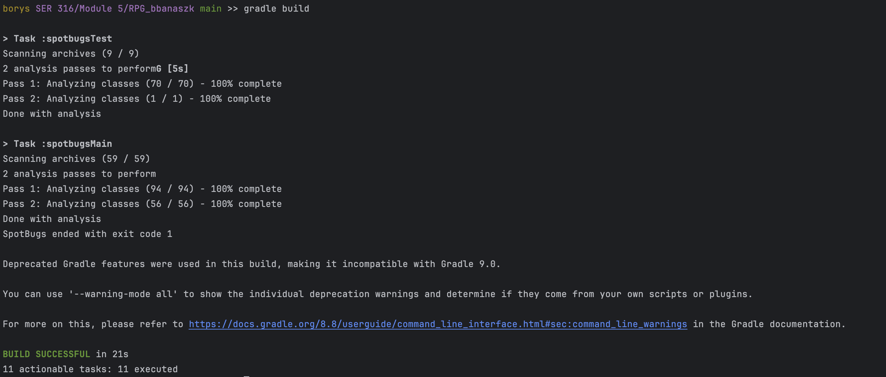
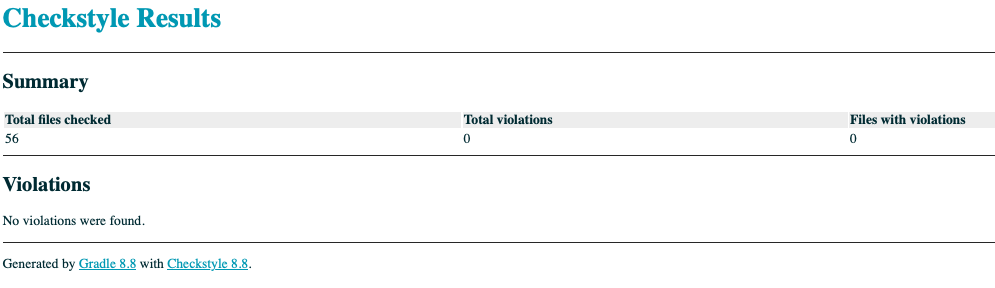
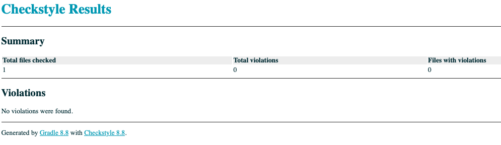
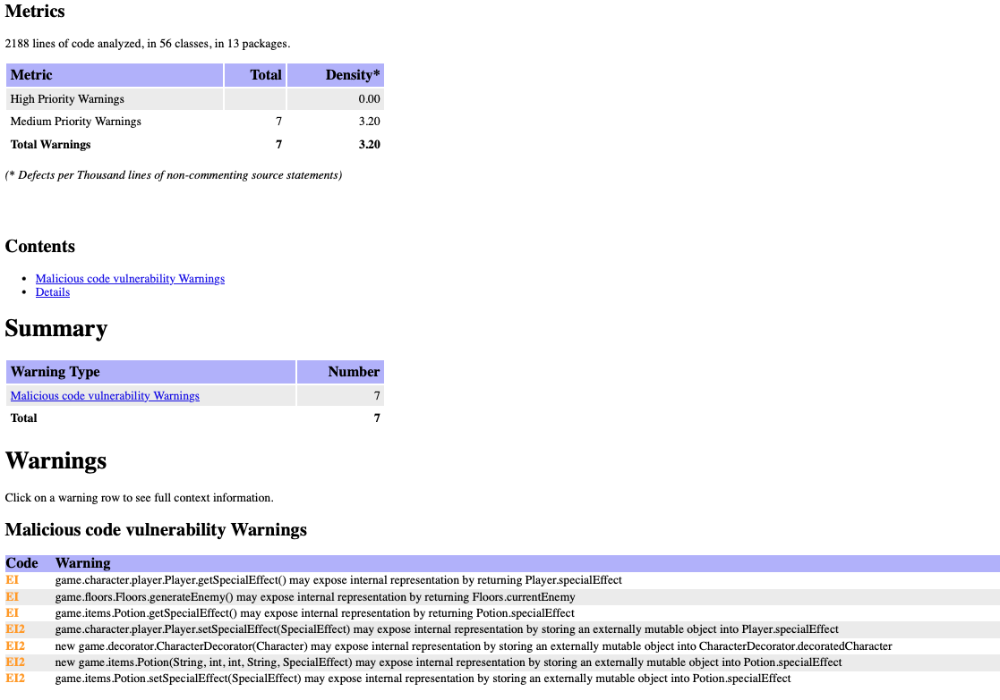
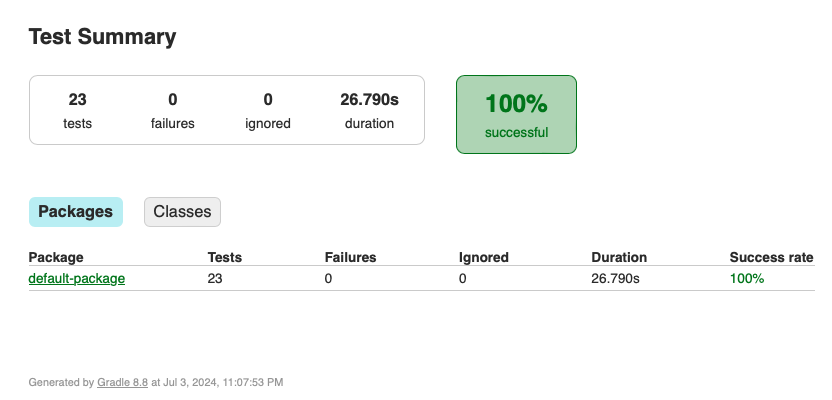
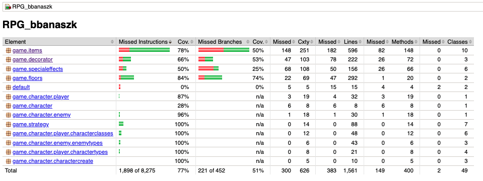

# Design Patterns - Borys Banaszkiewicz

## Description
I chose to implement 4 design patterns that all work together to have the program working as it should.

First, I chose the Factory design pattern for generating the Characters. The reason why I did this is because there are
many different combinations that can be obtained when creating a playable character (I have 6 character classes and 4 
character types) and each combination yields different attributes, so it made sense to create these characters by calling
a factory method and letting that method do the rest. All the character creation happens here so that the client (or game
controller) are able to only call createCharacter and can move on. This also works for generating enemies, which have 3
different types, different attributes, different loot they drop, and different xp and coins that they give when they are
defeated.

Next, I chose the decorator design pattern for managing the state of the character and the enemies throughout the game. 
I created the decorator using the same interface that was used for the factory design pattern. The reason why I chose 
this design pattern is that it allows for very easy modification to an object (in my case it's a character) by placing 
that object in a wrapper and adding new functionality without modifying the actual object that is wrapped. This was 
perfect for progressing and leveling up as all I did was add a multiplier variable that got incremented with each level 
up for both the player and the enemy, so that when calling getAttack or getDefense on an enemy or player, the decorator 
returns the original player or enemy health multiplied by the multiplier variable. This allowed the character class to 
remain completely untouched after instantiating even though the playable character was able to add items to inventory, 
level up, drink potions for special effects, lose/gain health from battles, etc. All this was done through the decorator 
without touching the character factory object.

For the combat I chose the Strategy design pattern because it allowed for a simple way to split the combat algorithms 
into classes and allowed me to generate a random move for both player or enemy by calling the strategy design interface,
letting the subclasses handle the rest. I implemented a separate class for each defense and attack algorithm and this kept
my code clean and reliable without needing to implement any combat algorithms within the main game logic.

Lastly I implemented the Mediator design pattern to handle the main flow of the game. I included only 1 method in the 
Mediator interface "updateGameState" which handles the entire game state by using cycles to progress the player through 
the game. 1 cycle is 20 floors long and is broken up into 4 parts that are swapped every 5 rounds (see comments in the 
GamePlay class that implements the FloorMediator for details). By using this design pattern, I was able to keep the entire
state of the game in my main method by using only a couple of lines of code: 3 for the creation of the character (did not 
do this in mediator just in case grader wants to play around with non-random combination of character class and type), and
1 while loop that stayed active until the game wasn't over with the only statement in the while loop being the call to the 
mediator (game.updateGameState()).

Using these design patterns together let me put together a reliable game and allowed any modifications to game logic to
be extremely easy.

Below are mainly the sources that I used to build my program.  
sources:  
[link1](https://refactoring.guru/design-patterns/catalog)  
[link2](https://www.tutorialspoint.com/design_pattern/mediator_pattern.htm)  

## Checkstyle and Spotbugs
All tests passed in checkstyle but spotbugs had some warnings that I did not think were necessary to fix. All the warnings
are due to "exposing internal representations" and with the simplicity of my program and having only 2 character types 
along with using a decorator, I don't actually modify any of these objects, so I did not think it is necessary to fix.  

  
  
  
    

## JUNIT Tests
The following are screenshot of my Test results. I did not get a chance to implement more testing as a lot of the functionality
that was left untested was also left not fully implemented due to not having time, but the major functionality was 
tested and can be seen in the Test class.  
  

